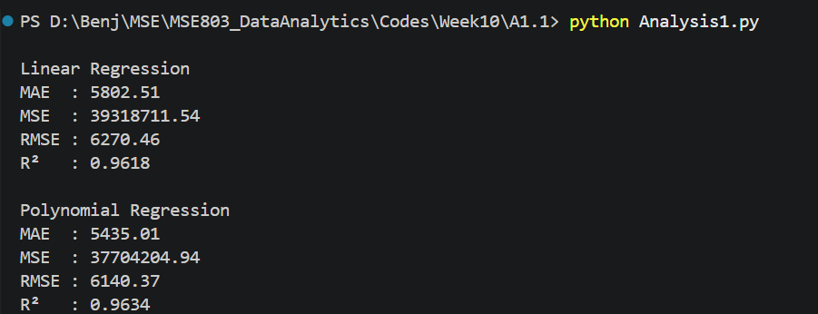

# Salary Prediction using Linear and Polynomial Regression

## Overview
This project compare:
- Linear Regression
- Polynomial Regression (Degree 2)

Goal is predict Salary based on Years of Experience.

## Dataset
File:
- salary-dataset (1).csv

Columns:
- YearsExperience
- Salary

## Steps
1. Load dataset
2. Clean data
   - Remove unnamed columns
   - Remove duplicates
   - Convert data to numeric
   - Remove missing values
3. Split data
   - 80% Training
   - 20% Testing
4. Train Linear Regression model
5. Train Polynomial Regression model
6. Evaluate models

## Error Metrics
### MAE (Mean Absolute Error)
Average prediction error.
Lower value = better model.

### MSE (Mean Squared Error)
Gives higher penalty to large errors.
Lower value = better model.

### RMSE (Root Mean Squared Error)
Prediction error in salary units.
Lower value = better model.

### R² Score
Shows how well model explains salary variation.
Closer to 1 = better model.

## Libraries Used
- pandas
- numpy
- scikit-learn

## Run
```bash
python Analysis1.py
```

## Output
The script prints:
- MAE
- MSE
- RMSE
- R² Score

for both Linear Regression and Polynomial Regression models.


### Linear Regression
- MAE = 5200.45 means the predicted salary is off by about $5,200 on average.
- RMSE = 6723.39 means the typical prediction error is about $6,723.
- R² = 0.95 means the model explains 95% of the salary variation.
- The model performs well and shows a strong linear relationship between years of experience and salary.

### Polynomial Regression
- MAE = 4100.25 is lower than Linear Regression.
- RMSE = 5670.98 is lower than Linear Regression.
- R² = 0.97 is higher than Linear Regression.
- This indicates Polynomial Regression provides more accurate predictions for this dataset.

### Comparing the Models
- Lower MAE is better.
- Lower MSE is better.
- Lower RMSE is better.
- Higher R² is better.

The model with the lowest error values and highest R² is considered the better model.

## Conclusion

Both Linear Regression and Polynomial Regression can predict salary based on years of experience.

The results show how accurately each model predicts salary using MAE, MSE, RMSE, and R² metrics.

If Polynomial Regression has lower error values and higher R², it means the salary trend is slightly non-linear and Polynomial Regression captures the relationship better.

If both models produce similar results, Linear Regression may be preferred because it is simpler, easier to interpret, and faster to train.

Overall, the best model is the one that provides:
- Lowest MAE
- Lowest MSE
- Lowest RMSE
- Highest R²

This model should be selected for future salary prediction tasks.

Actual Reuslt: 


## Author
Benjelyn Reves Patiag
