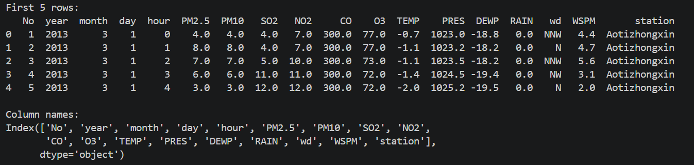
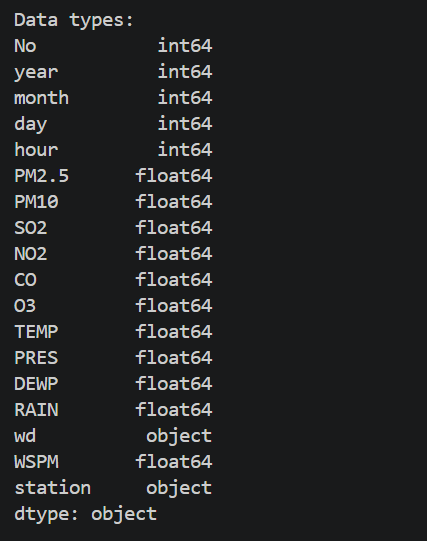
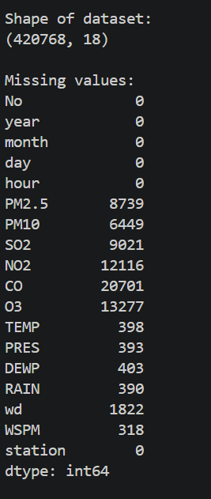

# Beijing Multi-Site Air Quality Analysis

Prepared by:  
Benjelyn Reves Patiag  
Week 2 Activity  
Date: April 2026  

---

## 📊 About the Data

This dataset contains air quality data from multiple monitoring stations in Beijing.

Each row represents hourly measurement data, including:
- Pollution levels (PM2.5, PM10, SO2, NO2, CO, O3)
- Weather data (temperature, pressure, dew point)
- Wind information
- Station name

This is time-series environmental data used for statistical analysis.

---

## ✅ Tasks Performed

### Task 1: Data Loading & Inspection
- Loaded all CSV datasets
- Combined into one dataset
- Displayed first 5 rows
- Identified column names and data types
- Counted total rows and columns

### Task 2: Data Cleaning
- Checked missing values
- Replaced missing values using mean
- Removed remaining null rows

### Task 3: Statistical Analysis
Performed:
- Mean
- Median
- Minimum
- Maximum
- Standard Deviation

---

## Output Screenshot





Mean:
No       17487.938906
year      2014.657412
month        6.524008
day         15.722840
hour        11.502511
PM2.5       79.705982
PM10       104.535997
SO2         15.843134
NO2         50.593469
CO        1228.956259
O3          57.505375
TEMP        13.562808
PRES      1010.732184
DEWP         2.493003
RAIN         0.064607
WSPM         1.735147
dtype: float64

Median:
No       17477.0
year      2015.0
month        7.0
day         16.0
hour        12.0
PM2.5       57.0
PM10        84.0
SO2          8.0
NO2         45.0
CO         900.0
O3          47.0
TEMP        14.5
PRES      1010.4
DEWP         3.1
RAIN         0.0
WSPM         1.4
dtype: float64

Minimum:
No          1.0000
year     2013.0000
month       1.0000
day         1.0000
hour        0.0000
PM2.5       2.0000
PM10        2.0000
SO2         0.2856
NO2         1.0265
CO        100.0000
O3          0.2142
TEMP      -19.9000
PRES      982.4000
DEWP      -36.0000
RAIN        0.0000
WSPM        0.0000
dtype: float64

Maximum:
No       35064.0
year      2017.0
month       12.0
day         31.0
hour        23.0
PM2.5      999.0
PM10       999.0
SO2        500.0
NO2        290.0
CO       10000.0
O3        1071.0
TEMP        41.6
PRES      1042.8
DEWP        29.1
RAIN        72.5
WSPM        13.2
dtype: float64

Standard Deviation:
No       10111.615494
year         1.175822
month        3.445256
day          8.801653
hour         6.916680
PM2.5       79.942595
PM10        91.047206
SO2         21.436598
NO2         34.603037
CO        1129.809387
SO2         21.436598
NO2         34.603037
SO2         21.436598
SO2         21.436598
SO2         21.436598
SO2         21.436598
SO2         21.436598
SO2         21.436598
NO2         34.603037
CO        1129.809387
O3          55.805418
NO2         34.603037
CO        1129.809387
O3          55.805418
TEMP        11.433703
PRES        10.474403
DEWP        13.799432
RAIN         0.822312
WSPM         1.244803
dtype: float64

---

## 🧠 Simple Insight

- PM2.5 and PM10 values show pollution levels
- Mean gives average pollution
- Standard deviation shows variation
- Some missing values exist due to sensor issues

---

## 🛠 Tools Used
- Python
- Pandas

---

## ▶️ How to Run

```bash
pip install pandas
python analysis.py