# Beijing Multi-Site Air Quality Analysis

Prepared by:  
Benjelyn Reves Patiag  
Week 2 Activity 2  
Date: April 21 2026  

---

## About the Data

This dataset contain air quality information from 12 monitoring station in Beijing, China.

Each row is one hourly measurement. The data have:

- **Pollution levels**: PM2.5, PM10, SO2, NO2, CO, O3
- **Weather data**: temperature, pressure, dew point
- **Wind information**: wind speed and wind direction
- **Station name**: 12 different location in Beijing

This is time-series environment data. Data range from March 2013 until February 2017. Total data after combine all station is **420,768 rows** and **18 columns**.

Source link: https://archive.ics.uci.edu/dataset/501/beijing+multi+site+air+quality+data

---

## How to Run the Code

```bash
pip install pandas matplotlib seaborn numpy
python analysis.py
```

All output picture is save in `output/` folder after run.

---

## All Task Perform

---

### Task 1: Data Loading and First Inspection

What we do here:
- Load all 12 CSV file from `data/` folder
- Combine into one big table using `pd.concat`
- Show first 5 row to see the data
- Show column name and data type
- Count total row and column

**Result:**
- Total rows: 420,768
- Total columns: 18
- Data type mix: integer, float, and string

---

### Task 2: Data Cleaning

Data have missing value because sensor sometime not work or broken. We need fix this before do analysis.

**What we do:**
- Check how many missing value in each column using `isnull().sum()`
- Replace missing **number** value using **mean** of that column: this is better than delete because we keep more data
- Remove row that still have missing value after replacement (mostly text column like wind direction)

**Missing value found:**
| Column | Missing Count |
|--------|--------------|
| CO | 20,701 |
| O3 | 13,277 |
| NO2 | 12,116 |
| SO2 | 9,021 |
| PM2.5 | 8,739 |
| Others | less than 2,000 |

**After cleaning:** 418,946 rows remaining. Only 1,822 row remove (very small, good).

---

### Task 3: Basic Statistical Analysis

We study the number of pollution and weather column.

**Pollutants analysed:** PM2.5, PM10, SO2, NO2, CO, O3, TEMP, PRES, DEWP, RAIN, WSPM

**Summary Statistics:**

| Pollutant | Mean | Median | Min | Max | Std Dev |
|-----------|------|--------|-----|-----|---------|
| PM2.5 | 79.71 | 57.0 | 2.0 | 999.0 | 79.94 |
| PM10 | 104.54 | 84.0 | 2.0 | 999.0 | 91.05 |
| SO2 | 15.84 | 8.0 | 0.29 | 500.0 | 21.44 |
| NO2 | 50.59 | 45.0 | 1.03 | 290.0 | 34.60 |
| CO | 1228.96 | 900.0 | 100.0 | 10000.0 | 1129.81 |
| O3 | 57.51 | 47.0 | 0.21 | 1071.0 | 55.81 |

**Simple insight:**
- PM2.5 mean is 79.71 but median is only 57: this mean there are very high value on some day that pull up the average
- CO have very big max value (10,000) compare to mean (1,229): very extreme pollution happen sometime
- Standard deviation of PM2.5 is almost same as mean: the data spread very wide, pollution level change a lot

---

### Task 4: Data Filtering by Station

We filter data to look at one specific station and compare all station.

**Station filter example: Dongsi station**
- Total row for Dongsi: 34,986

**Average PM2.5 by Station (high to low):**

| Station | Avg PM2.5 | Avg PM10 |
|---------|-----------|----------|
| Dongsi | 86.01 | 110.19 |
| Wanshouxigong | 84.89 | 112.11 |
| Nongzhanguan | 84.72 | 108.90 |
| Gucheng | 83.68 | 118.64 |
| Wanliu | 83.33 | 110.42 |
| Guanyuan | 82.85 | 108.93 |
| Aotizhongxin | 82.67 | 109.94 |
| Tiantan | 82.10 | 106.33 |
| Shunyi | 78.99 | 98.30 |
| Changping | 71.18 | 94.72 |
| Huairou | 69.76 | 91.72 |
| Dingling | 66.19 | 84.05 |

**Insight:** Station in city centre (like Dongsi) have more pollution than station in suburb area (like Dingling and Huairou). This make sense because more car and factory in city.

---

### Task 5: Data Visualization

We create 3 type of chart to see the data visually.

**Chart 1: Histogram of PM2.5** (`output/histogram_pm25.png`)
- Show how many time each PM2.5 level happen
- Most data cluster on low-to-medium level (below 150)
- But there are data going all the way to 999 (extreme pollution day)
- Red dashed line show the average (79.71)

**Chart 2: Line Plot of PM2.5 Over Time** (`output/lineplot_pm25_overtime.png`)
- Show monthly average PM2.5 from 2013 to 2017
- Can see seasonal pattern: PM2.5 go high in winter months (November to February)
- In summer months, PM2.5 go down
- This pattern repeat every year

**Chart 3: Boxplot of Pollutants** (`output/boxplot_pollutants.png`)
- Compare spread of PM2.5, PM10, SO2, NO2, O3 in one chart
- PM10 have biggest box and many outlier dot: most variable pollutant
- SO2 have smallest box: more consistent level
- Red line inside box is the median value

---

### Task 6: Correlation Analysis

Correlation number tell us if two variable go up and down together.
- Value near **+1** = when one go up, other also go up (positive)
- Value near **-1** = when one go up, other go down (negative)
- Value near **0** = no clear relationship

**Correlation with PM2.5 (from strongest):**

| Variable | Correlation | Meaning |
|----------|-------------|---------|
| PM10 | +0.879 | Very strong: both particle size go up together |
| CO | +0.769 | Strong: come from same source (burning) |
| NO2 | +0.658 | Moderate-strong: traffic pollution |
| SO2 | +0.478 | Moderate: industry and burning |
| DEWP | +0.114 | Weak positive |
| WSPM | -0.269 | Negative: wind blow away pollution |
| O3 | -0.147 | Weak negative |
| TEMP | -0.129 | Weak negative |

**Most correlated variable with PM2.5: PM10 (r = 0.879)**

This make sense because PM2.5 and PM10 are both small particle from same pollution source like car, factory, and burning.

**Does temperature affect pollution?**
- Correlation between TEMP and PM2.5 is **-0.129**
- This is weak negative relationship
- Temperature alone not strongly predict PM2.5
- But we can see from line chart that winter (cold temperature) have higher pollution than summer
- This because people burn more coal and gas for heating in winter, not just because of temperature itself

**Heatmap chart** (`output/heatmap_correlation.png`): show all correlation in colour:
- Red = positive correlation
- Blue = negative correlation
- Number inside each box is correlation value

**Scatter plot** (`output/scatter_temp_vs_pm25.png`): each dot is one data point of temperature vs PM2.5, red line is trend.

---

## Output Files

After run `analysis.py`, these file is created in `output/` folder:

| File | Description |
|------|-------------|
| `histogram_pm25.png` | Distribution of PM2.5 level |
| `lineplot_pm25_overtime.png` | PM2.5 trend by month over years |
| `boxplot_pollutants.png` | Compare spread of 5 pollutants |
| `heatmap_correlation.png` | Colour map of all variable correlation |
| `scatter_temp_vs_pm25.png` | Temperature vs PM2.5 relationship |
| `avg_pollution_by_station.csv` | Average pollution for each station |

---

## Tools Used

- Python 3
- Pandas: for load, clean, and analyse data
- Matplotlib: for draw chart
- Seaborn: for draw heatmap
- NumPy: for math calculation

---

## Key Finding Summary

1. **PM10 is most correlated with PM2.5**: both pollutant come from same source
2. **Winter have more pollution than summer**: people burn more for heat
3. **City centre station have more pollution** than rural/suburb station
4. **Wind speed negative correlation** with PM2.5: wind help clean air
5. **Beijing air quality sometime very extreme**: PM2.5 can reach 999 µg/m³ on bad day (WHO guideline is only 15 µg/m³ daily average)

---

## Screenshot Output

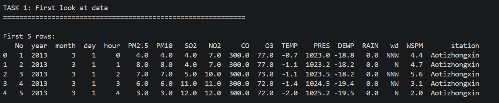
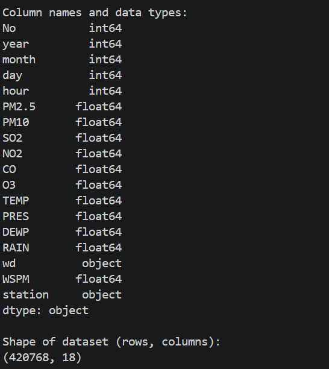
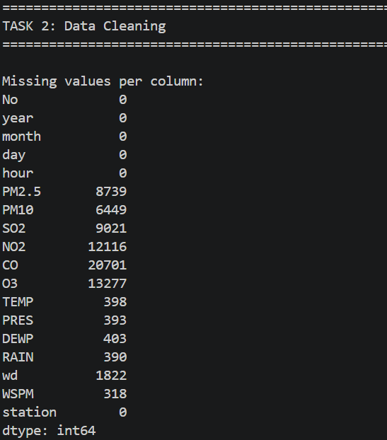
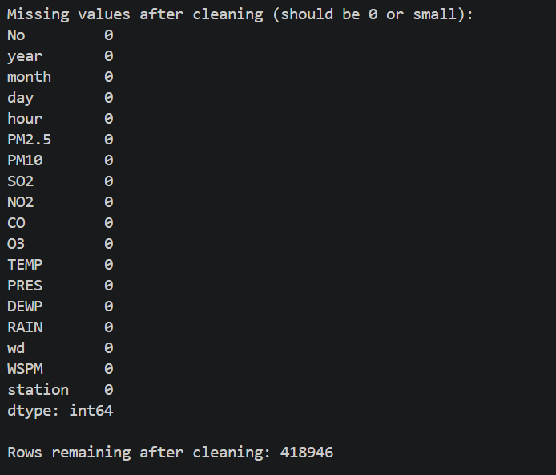
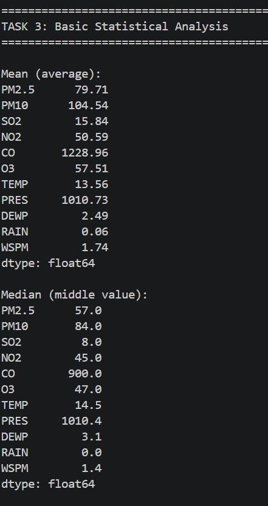
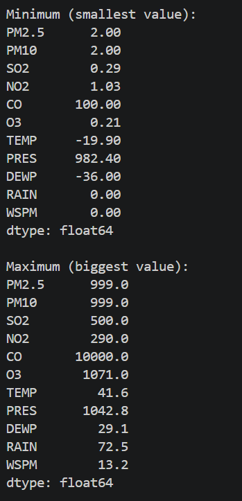
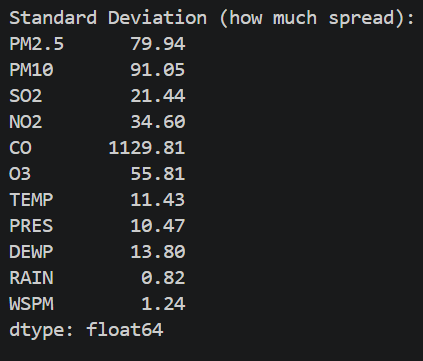
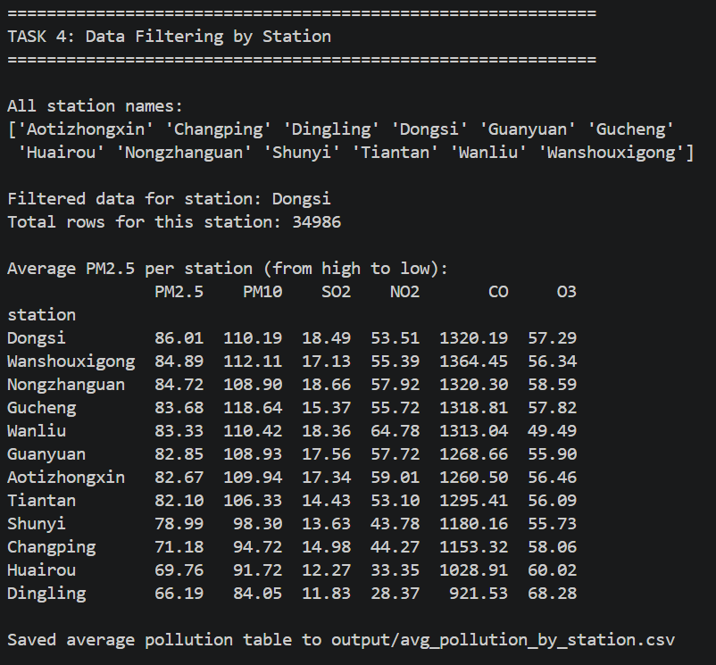
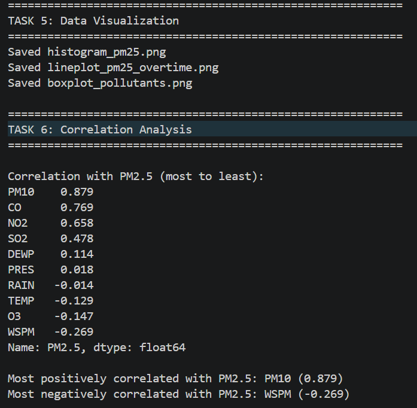
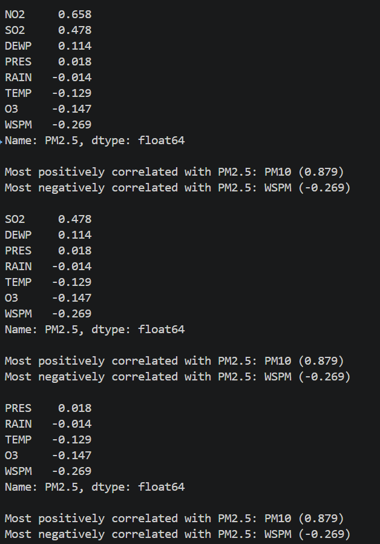
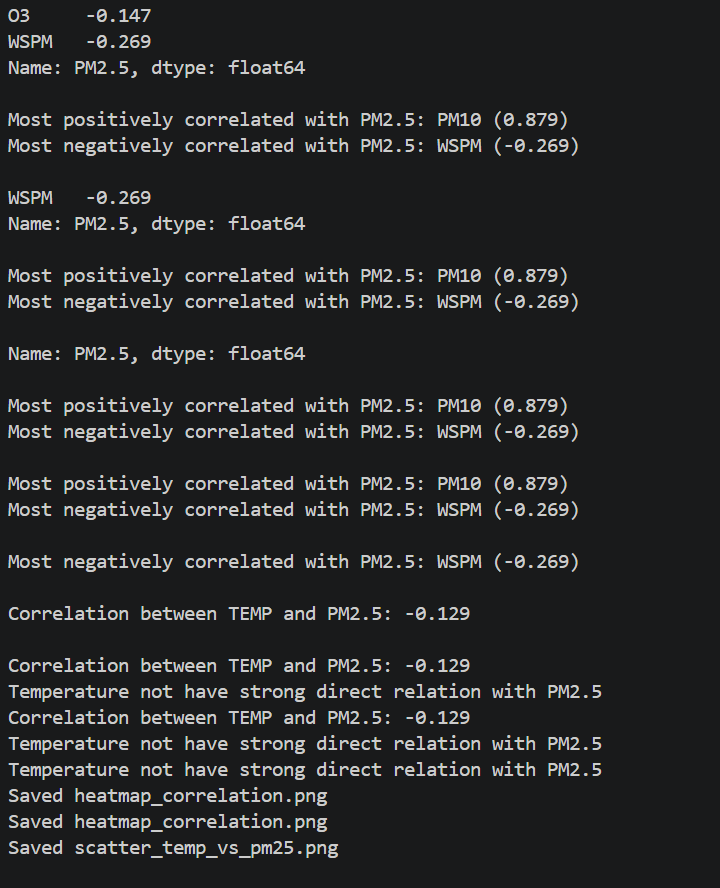
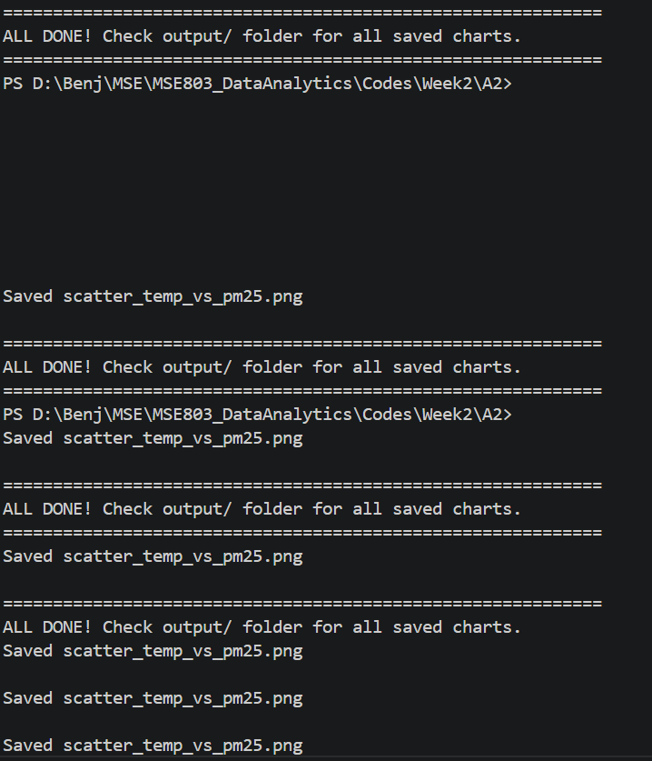
