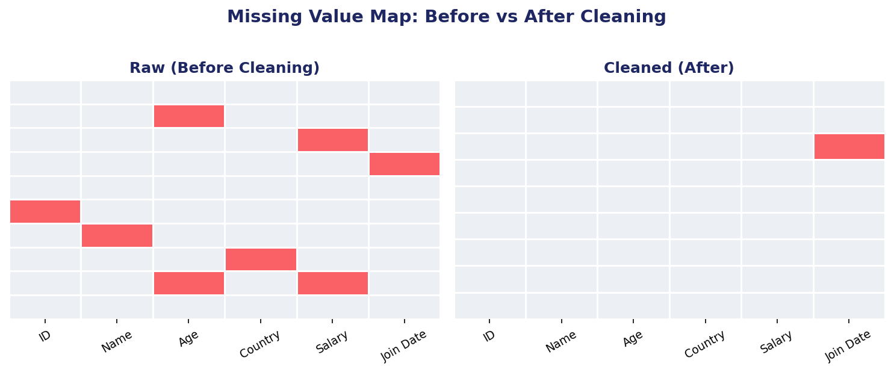
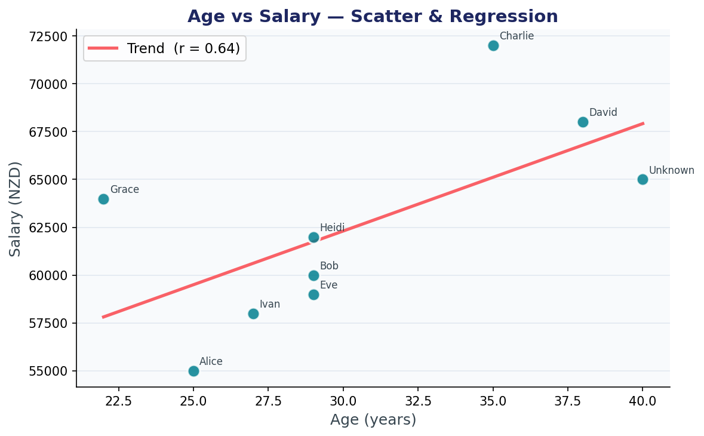
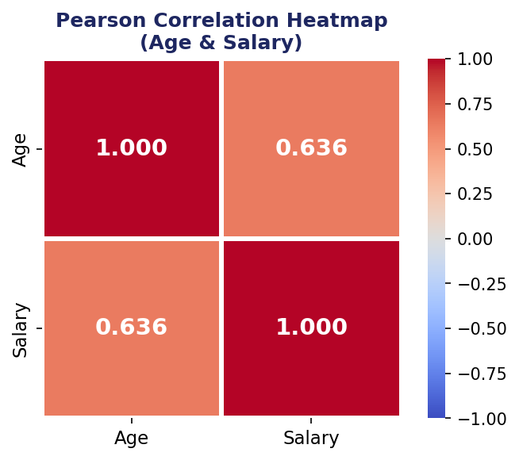
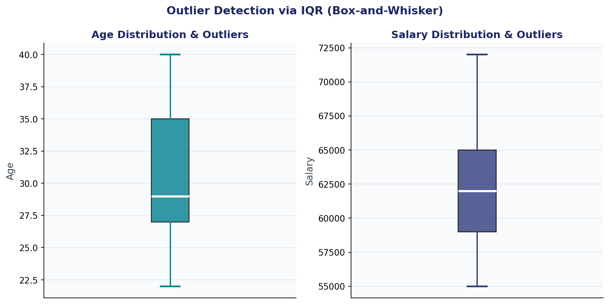
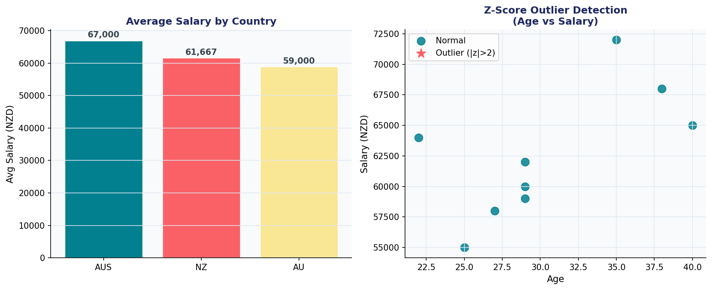
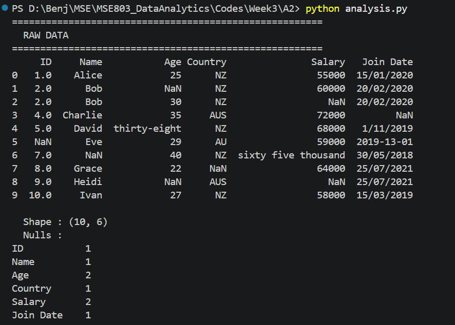
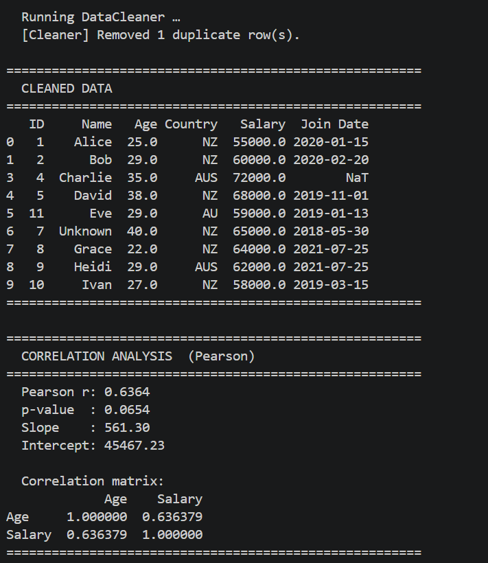
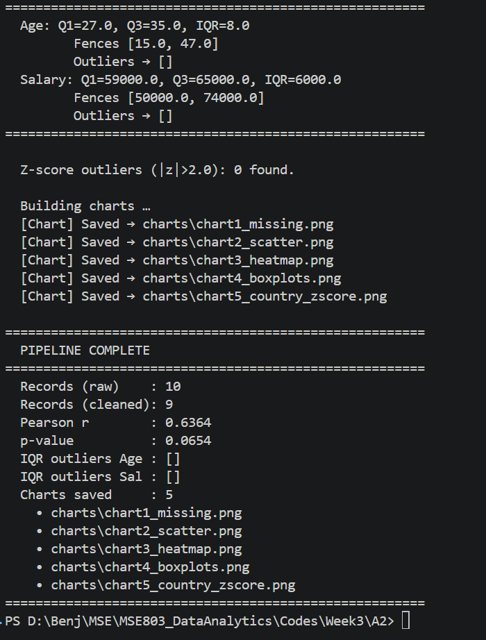

# 📊 Messy Data: Cleaning, Correlation & Visualisation

> **By:** Benjelyn Reves Patiag &nbsp;|&nbsp; **Date:** 28 April 2026
> **File:** `messy_dataset_Mukesh.csv` &nbsp;|&nbsp; **Tools:** Python · Pandas · SciPy · Seaborn · Matplotlib

---

## 🤔 About this task:

messy_dataset_Mukesh.csv got many problem inside: missing number, wrong date,
same person appear two time, number is written as word like "thirty-eight" instead of 38.
Month 13 also appear in the date

All this problem was found. All this problem was fixed. After cleaning, the data was study
to answer one question:

> **"Is Age connected to Salary? If person is older, do they earn more money?"**

Pearson method was used to answer this. Also, outlier was check: is anyone salary or age
way too extreme compare to others?

Five picture (chart) was made to show the finding. Everything was put in PowerPoint too.

---


**What must be done (checklist):**

- ✅ All missing value handle: fill with middle number (median) or most common (mode)
- ✅ All duplicate row remove
- ✅ Text-as-number convert to real number
- ✅ Broken date fix
- ✅ Pearson r calculate using `scipy.stats.pearsonr`
- ✅ Outlier check done with IQR method AND Z-score method
- ✅ 5 chart save as picture (PNG)
- ✅ Code write in 6 class, each class have one job
- ✅ README write in simple English for everyone


---

## 🔴 What Problem Was In The Data?

The original file have 10 row but many thing was broken:

| # | Problem | Example | How Fix |
|---|---------|---------|---------|
| 1 | **Duplicate row** | "Bob" appear 2 time (row 1 and row 2) | Second Bob was delete |
| 2 | **Missing Age (×2)** | Empty, no number | Fill with middle number: 29 year |
| 3 | **Missing Salary (×2)** | Empty, no number | Fill with middle number: $62,000 |
| 4 | **Age written as word** | `thirty-eight` instead of `38` | Change to real number |
| 5 | **Salary written as word** | `sixty five thousand` instead of `65000` | Change to real number |
| 6 | **Date is broken** | `2019-13-01`: month 13 not exist! | Fix to correct date: Jan 2019 |
| 7 | **Name is missing** | Row have no name | Put `'Unknown'` as placeholder |
| 8 | **Country is missing** | Row have no country | Fill with most common: `NZ` |

**Before fix:** 10 row, many problem &nbsp;|&nbsp; **After fix:** 9 clean row, zero problem 🎉

---

## 🏗️ Code Structure


```
AnalysisPipeline           ← The boss. Call everyone else in order.
    │
    ├── DataLoader          ← Job: Read the CSV file from disk
    ├── DataCleaner         ← Job: Fix all the messy problem
    ├── CorrelationAnalyzer ← Job: Calculate Pearson r and trend line
    ├── OutlierDetector     ← Job: Find extreme/unusual value
    └── ChartBuilder        ← Job: Make and save all 5 chart
```

---

### 📦 Class 1: `DataLoader`

**What it do:** Open the CSV file. Show what is inside. Count how many empty value exist.

```python
class DataLoader:
    def __init__(self, filepath: str):
        self.filepath = filepath     # save the path

    def load(self) -> pd.DataFrame:
        self.raw_df = pd.read_csv(self.filepath)  # read file
        print(self.raw_df)                         # show data
        print(self.raw_df.isnull().sum())          # count empty
        return self.raw_df                         # give back DataFrame
```

**How to use:**
```python
loader = DataLoader("messy_dataset_Mukesh.csv")
df = loader.load()
```

---

### 🧹 Class 2: `DataCleaner`

**What it do:** Take the messy data and fix everything. It have 5 private helper method inside —
each helper fix one type of problem.

```python
class DataCleaner:
    AGE_MAP    = {"thirty-eight": 38}           # word → number table
    SALARY_MAP = {"sixty five thousand": 65000}

    def __init__(self, df):
        self.df = df.copy()   # make copy: never touch original!

    def _fix_text_numbers(self)  # fix word-as-number → real number
    def _remove_duplicates(self) # delete second Bob
    def _parse_date(value)       # try many date format, fix broken one
    def _fix_dates(self)         # apply _parse_date to whole column
    def _impute_missing(self)    # fill empty with median or mode

    def clean(self) -> pd.DataFrame:
        # call all 5 helper, then return clean data
```

**Why underscore before name (`_method`)?**
In Python, underscore mean "private": this helper is only for inside use,
other code outside should not call it directly.

---

### 📐 Class 3: `CorrelationAnalyzer`

**What it do:** Calculate how strong is the connection between Age and Salary.
Use Pearson method from `scipy.stats`.

```python
class CorrelationAnalyzer:
    def __init__(self, df, col_x='Age', col_y='Salary'):
        self.col_x      = col_x        # the X thing (default: Age)
        self.col_y      = col_y        # the Y thing (default: Salary)
        self.pearson_r  = 0.0          # result store here
        self.p_value    = 0.0
        self.slope      = 0.0
        self.intercept  = 0.0

    def analyze(self) -> dict:
        # pearsonr() → give r value and p-value
        self.pearson_r, self.p_value = stats.pearsonr(x, y)
        # linregress() → give slope and intercept for trend line
        self.slope, self.intercept, *_ = stats.linregress(x, y)
        # .corr() → make full correlation table
        self.corr_matrix = df.corr(method='pearson')
```

**Result:** `pearson_r = 0.6364` → moderate positive. Older person earn more!

---

### 🔍 Class 4: `OutlierDetector`

**What it do:** Use TWO different method to find any person with extreme/unusual value.

**Method 1: IQR (Box method):**
```python
def detect_iqr(self):
    Q1    = series.quantile(0.25)   # bottom 25%
    Q3    = series.quantile(0.75)   # top 25%
    IQR   = Q3 - Q1                 # the middle range
    lower = Q1 - 1.5 * IQR          # below this = outlier
    upper = Q3 + 1.5 * IQR          # above this = outlier
    outliers = series[(series < lower) | (series > upper)]
```

**Method 2: Z-Score:**
```python
def detect_zscore(self):
    z_abs = np.abs(stats.zscore(numeric))     # how many step from average?
    numeric['outlier'] = z_abs.max(axis=1) > 2.0   # if too far = outlier
```

**Result:** Both method say → **zero outlier found!** Everyone is normal.

---

### 📊 Class 5: `ChartBuilder`

**What it do:** Make all 5 picture and save them as PNG file.
Each chart have own method.

```python
class ChartBuilder:
    def chart1_missing_heatmap(self)     → Picture 1: missing value map
    def chart2_scatter_regression(self)  → Picture 2: scatter + trend line
    def chart3_pearson_heatmap(self)     → Picture 3: Pearson colour grid
    def chart4_boxplots(self)            → Picture 4: box plot outlier
    def chart5_country_zscore(self)      → Picture 5: country salary + z-score

    def build_all(self) -> list:
        # call all 5 method, save all picture, return list of file path
```

---

### 🏃 Class 6: `AnalysisPipeline`

**What it do:** The boss class! Call all other class in correct order.
Only need to call `.run()` and everything happen automatic.

```python
class AnalysisPipeline:
    def run(self):
        # Stage 1: load
        loader   = DataLoader(self.csv_path)
        raw_df   = loader.load()

        # Stage 2: clean
        cleaner  = DataCleaner(raw_df)
        clean_df = cleaner.clean()

        # Stage 3: correlation
        analyzer = CorrelationAnalyzer(clean_df)
        analyzer.analyze()

        # Stage 4: outlier check
        detector = OutlierDetector(clean_df)
        detector.detect_iqr()
        detector.detect_zscore()

        # Stage 5: make chart
        builder  = ChartBuilder(...)
        builder.build_all()
```

---

## 💻 How To Run The Code

### Install First

```bash
# Python library
pip install pandas numpy matplotlib seaborn scipy

```

### Run The Analysis

```bash
# Make sure messy_dataset_Mukesh.csv is in same folder!
python analysis.py
```

---

## 🖥️ Code Run Screenshot

### Screenshot 1: DataLoader: Raw Data Appear


The raw data appear on screen with all problem visible: NaN (empty), text number, duplicate Bob.
The null count show how many empty in each column:
Age empty = 2, Salary empty = 2, Name empty = 1, Country empty = 1, ID empty = 1.

---

### Screenshot 2: DataCleaner: Clean Data Appear


After clean, the data look proper: 9 row, all value present, no text number,
no broken date. Second Bob was remove. "thirty-eight" become 38. "sixty five thousand" become 65000.

---

### Screenshot 3: Pearson + Outlier Result


Pearson r = 0.6364 appear in orange colour (important number!).
IQR fence for Age = [15.0, 47.0] and Salary = [50,000, 74,000].
Both show empty list `[]`: nobody is outlier. Z-score also confirm: 0 outlier found.

---

### Screenshot 4: Pipeline Finish! All Chart Save


Final summary show: 10 raw row, 9 clean row, Pearson r value, and list of 5 chart file
that was save to the charts folder. Green text mean everything go well!

---

## 🖼️ All 5 Chart: What Each Picture Show

### Missing Value Map (Before and After Clean)



**What it show:**
Two panel side by side. Left panel = raw data: red square appear everywhere (red = missing value).
Right panel = after clean: almost no red left! Only one small red remain for the broken date
that cannot be recover.

**Finding:**
Before clean: missing value scatter across Age, Salary, Country, Name, ID, and Join Date.
After clean: almost all missing value is gone. The cleaning work!

---

### Scatter Plot + Trend Line



**What it show:**
Every dot = one person. Left-right position = their age. Up-down position = their salary.
The red line go from bottom-left to top-right: this show the trend.

How to read:
- Dot on left = young person. Dot on right = old person.
- Dot on bottom = low salary. Dot on top = high salary.
- Red line going up to right = older age connect to higher salary!

**Finding:**
Alice (youngest, age 22) is in bottom-left with lowest salary $55,000.
Charlie (age 35) and David (age 38) are in top-right with higher salary.
Pearson r = 0.64 printed in legend. Pattern is clear!

---

### Pearson Colour Grid (Heatmap)



**What it show:**
A 2×2 colour grid. Each box show the correlation number between two thing.
Dark red = strong positive connection. Blue = negative connection.

- `Age vs Age` = 1.000 (always perfect, because same thing with itself)
- `Salary vs Salary` = 1.000 (same reason)
- **`Age vs Salary` = 0.636** ← this is the important number!

**Finding:**
0.636 appear in two box: top-right and bottom-left. This is because correlation is same
both way: Age vs Salary = Salary vs Age. The warm red colour show positive moderate connection.

---

### Box Plot (Outlier Check by IQR)



**What it show:**
Two box plot: one for Age and one for Salary.

How to read:
- The **box** = where middle 50% of people sit (Q1 to Q3)
- The **white line** inside = median (middle person)
- The **whisker** above and below = normal range limit
- **Red dot** outside whisker = outlier (that person too extreme)

**Finding:**
No red dot visible in either box plot! This confirm: nobody in this data have extreme
age or salary. IQR fence for Age = [15, 47 year]. IQR fence for Salary = [$50,000, $74,000].
All 9 person sit inside the fence. Dataset is balance.

---

### Salary by Country + Z-Score Outlier Check



**What it show:**
Two chart in one picture:
- **Left bar chart:** average salary for each country: AUS highest, then NZ, then AU
- **Right scatter:** same people as dot. Teal circle = normal person. Red star = outlier.
  All dot are teal circle: zero outlier!

**Finding:**
Australia employee have highest average salary: $67,000.
New Zealand is middle: $61,667. AU is lowest: $59,000.
Z-score method agree with IQR method: no outlier found.

---

## 📈 What Is Correlation?

**Correlation** = how much two thing move together.

Pearson method give number between -1 and +1:

| Number | Meaning |
|--------|---------|
| `+1.0` | Perfect positive: one go up, other ALWAYS go up |
| `+0.7 to +1.0` | Strong positive |
| **`+0.4 to +0.7`** | **Moderate positive ← this result! (r = 0.636)** |
| `0.0` | No connection at all |
| `-0.4 to -0.7` | Moderate negative |
| `-1.0` | Perfect negative: one go up, other ALWAYS go down |

---

## 📊 Final Number Result

```
File used      : messy_dataset_Mukesh.csv
Row before fix : 10
Row after fix  : 9  (1 duplicate remove)
Problem fix    : 7

Pearson r      : 0.6364   (moderate positive)
p-value        : 0.0654   (little bit above 0.05: small sample!)
Slope          : 561.30   (each 1 year older = $561 more salary)

Age   → average: 30.4 year, min: 22, max: 40
Salary → average: $62,556, min: $55,000, max: $72,000

IQR outlier (Age)    : NONE
IQR outlier (Salary) : NONE
Z-score outlier      : NONE (all |z| less than 2.0)

Salary by country:
  AUS = $67,000  (highest)
  NZ  = $61,667
  AU  = $59,000
```


## 📚 Tool List: What Each Tool Do

| Tool | What It Do |
|------|-----------|
| **Python** | Main language. Instruction to computer. |
| **Pandas** | Work with table data. Like Excel but in code. |
| **NumPy** | Math and number calculation. |
| **SciPy** | Science math. `scipy.stats.pearsonr` = Pearson correlation. `scipy.stats.zscore` = Z-score for outlier. |
| **Seaborn** | Make pretty chart. It build on top of Matplotlib. |
| **Matplotlib** | The original Python chart tool. |


---

## ⚠️ Warning About Small Data

This data only have 9 row after clean. That is **very small**.
In real analysis, hundred or thousand row is need for strong result.

The Pearson r = 0.636 look good but p-value = 0.065 is little bit above 0.05.
This mean:
- The connection probably is real
- But with only 9 person, cannot be 100% sure
- More data is need to be more confident

**Lesson:** Clean data good + correct method good + but sample size also must be big!

---

## 🔑 Key Finding

1. **Data was messy but fixable**: 7 problem found and all fix with Python
2. **Age and Salary got moderate positive connection**: r = 0.636, older person tend to earn more
3. **Zero outlier found**: IQR and Z-score both confirm, nobody is extreme
4. **Australia pay most**: AUS $67k is higher than NZ $61.7k and AU $59k
5. **Small data warning**: only 9 person, p = 0.065, more data is need for stronger proof
6. **OOP code is clean**: 6 class, each have one responsibility, easy to read and change

---
## Screenshot Output





---