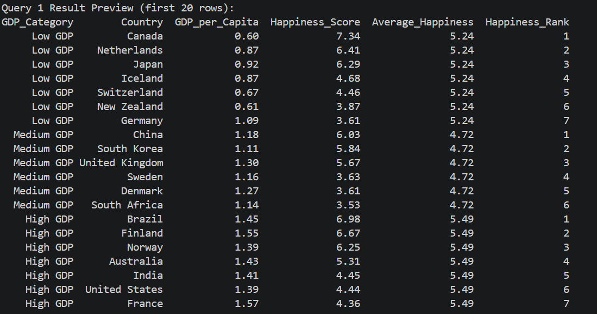
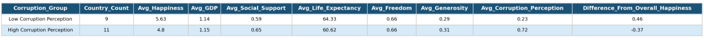

Data Aggregation using World Happiness Dataset

**Prepared by:** Benjelyn Reves Patiag  
**Subject:** MSE803 Data Analytics

---

## Overview

This activity use the World Happiness dataset to perform SQL data aggregation and comparison. The analysis is focus on two question:

1. **GDP and Happiness**: To if richer country tend to be happier? Group country by GDP level, calculate average happiness per group, and rank country inside each group.
2. **Corruption and Happiness**: Do country with high corruption perception have lower happiness? Split country into two group based on corruption score and compare many happiness indicator between them.

---

## Dataset

The dataset have country-level happiness and social/economic indicator:

| Column | Description |
|---|---|
| `Country` | Name of country |
| `Happiness_Score` | Overall happiness score (higher = more happy) |
| `GDP_per_Capita` | Economic output per person (normalised 0–2 scale) |
| `Social_Support` | Feeling of having someone to depend on |
| `Healthy_Life_Expectancy` | Expected number of healthy life year |
| `Freedom_to_Make_Choices` | Freedom score (0–1 scale) |
| `Generosity` | Charitable giving score |
| `Perceptions_of_Corruption` | How much people feel corruption exist in society |

---

## Script Architecture

The Python script is organise into **seven classes**, each with single responsibility:

```
WorldHappinessAnalysis          ← Boss class, coordinate everything
├── Config                      ← Hold all path and setting
├── WorldHappinessQueries       ← Hold the two SQL query string
├── DatabaseManager             ← Load CSV into SQLite, run query
├── ResultExporter              ← Save result as CSV and PNG image
└── ConsolePrinter              ← Print formatted output to terminal
```

---

## Query 1: GDP Categories, Average Happiness, and Country Ranking

### Purpose

To understand if economic wealth (measured by GDP per capita) is connected to happiness level. By the following:

1. Classify every country into one of three GDP tier
2. See the average happiness for each tier (not just individual country)
3. Rank country within each tier to identify the top performer


---

### SQL Query

```sql
WITH gdp_grouped AS (
    SELECT
        Country,
        Happiness_Score,
        GDP_per_Capita,
        CASE
            WHEN GDP_per_Capita < 1.0967 THEN 'Low GDP'
            WHEN GDP_per_Capita < 1.3600 THEN 'Medium GDP'
            ELSE 'High GDP'
        END AS GDP_Category
    FROM world_happiness
),
category_average AS (
    SELECT
        GDP_Category,
        ROUND(AVG(Happiness_Score), 2) AS Average_Happiness
    FROM gdp_grouped
    GROUP BY GDP_Category
),
ranked_countries AS (
    SELECT
        Country,
        GDP_Category,
        GDP_per_Capita,
        Happiness_Score,
        RANK() OVER (
            PARTITION BY GDP_Category
            ORDER BY Happiness_Score DESC
        ) AS Happiness_Rank
    FROM gdp_grouped
)
SELECT
    r.GDP_Category,
    r.Country,
    r.GDP_per_Capita,
    r.Happiness_Score,
    a.Average_Happiness,
    r.Happiness_Rank
FROM ranked_countries r
JOIN category_average a
    ON r.GDP_Category = a.GDP_Category
ORDER BY
    CASE r.GDP_Category
        WHEN 'Low GDP' THEN 1
        WHEN 'Medium GDP' THEN 2
        WHEN 'High GDP' THEN 3
    END,
    r.Happiness_Rank;
```

---


### Query 1: GDP Category, Average Happiness, and Ranking

This query groups countries into Low GDP, Medium GDP, and High GDP categories based on their GDP per capita value.

The threshold values are not random. They are based on the actual dataset distribution:

- 33rd percentile = 1.0967
- 66th percentile = 1.3600

This means the countries are divided into almost equal groups:

- Low GDP = countries below 1.0967
- Medium GDP = countries from 1.0967 to below 1.3600
- High GDP = countries equal or above 1.3600

This method is better than manually choosing values because it is data-driven. It reduces bias and makes the grouping fairer.

The query uses three main steps:

1. `gdp_grouped`
   - This step creates the GDP category using a `CASE` statement.
   - Each country is labelled as Low GDP, Medium GDP, or High GDP.

2. `category_average`
   - This step calculates the number of countries and the average happiness score for each GDP category.
   - This helps compare happiness between Low, Medium, and High GDP groups.

3. `ranked_countries`
   - This step ranks countries inside each GDP category.
   - The country with the highest happiness score in the same GDP group gets rank 1.

The final output shows each country, its GDP category, GDP per capita, happiness score, group average happiness, and rank inside the same GDP category.

### Findings

The result shows that High GDP countries have the highest average happiness score at 5.49. Low GDP countries have an average happiness score of 5.24, while Medium GDP countries have the lowest average score at 4.72.

This means GDP can still have some relationship with happiness, but it is not the only factor. Some Low GDP countries can still have high happiness scores, and some High GDP countries can still have lower happiness scores.

Therefore, happiness is affected by many factors, not only GDP. Social support, life expectancy, freedom, generosity, and corruption perception may also influence happiness.

### Output



**Key Insight:**

    High GDP → higher average happiness.  
    But inside each GDP group → still big variation.  
    Meaning: GDP helps, but not enough to explain happiness.
---

## Query 2: High vs Low Corruption Perception Comparison

### Purpose

Goal is to check if corruption perception connect to happiness.

Countries split into 2 groups:

    high corruption perception
    low corruption perception

Then compare many wellbeing indicators between groups.

Use dataset average as benchmark (not fixed value).
This means threshold auto change when data change.

---

### SQL Query

```sql
WITH corruption_groups AS (
    SELECT
        Country,
        Happiness_Score,
        GDP_per_Capita,
        Social_Support,
        Healthy_Life_Expectancy,
        Freedom_to_Make_Choices,
        Generosity,
        Perceptions_of_Corruption,
        CASE
            WHEN Perceptions_of_Corruption >= (
                SELECT AVG(Perceptions_of_Corruption)
                FROM world_happiness
            ) THEN 'High Corruption Perception'
            ELSE 'Low Corruption Perception'
        END AS Corruption_Group
    FROM world_happiness
)
SELECT
    Corruption_Group,
    COUNT(*) AS Country_Count,
    ROUND(AVG(Happiness_Score), 2) AS Avg_Happiness,
    ROUND(AVG(GDP_per_Capita), 2) AS Avg_GDP,
    ROUND(AVG(Social_Support), 2) AS Avg_Social_Support,
    ROUND(AVG(Healthy_Life_Expectancy), 2) AS Avg_Life_Expectancy,
    ROUND(AVG(Freedom_to_Make_Choices), 2) AS Avg_Freedom,
    ROUND(AVG(Generosity), 2) AS Avg_Generosity,
    ROUND(AVG(Perceptions_of_Corruption), 2) AS Avg_Corruption_Perception,
    ROUND(
        AVG(Happiness_Score) - (
            SELECT AVG(Happiness_Score)
            FROM world_happiness
        ), 2
    ) AS Difference_From_Overall_Happiness
FROM corruption_groups
GROUP BY Corruption_Group
ORDER BY Avg_Happiness DESC;
```

---

### Step 1: Create Group (CTE)

Use this logic:

CASE
    WHEN Perceptions_of_Corruption >= AVG(dataset)
    THEN 'High'
    ELSE 'Low'

Meaning:
- If country corruption >= average → High group
- If lower than average → Low group

Important:
- AVG() come from subquery
- Not fixed number
- It follow the dataset (auto adjust)

Example:
- 0.18 >= 0.12 → High
- 0.07 < 0.12 → Low

So all country now have label.

---

### Step 2: GROUP BY

GROUP BY Corruption_Group

This make 2 bucket:
- High group
- Low group

All country go inside one bucket.

---

### Step 3: Calculate Averages

Compute many AVG():

- Avg_Happiness
- Avg_GDP
- Avg_Social_Support
- Avg_Life_Expectancy
- Avg_Freedom
- Avg_Generosity
- Avg_Corruption

Purpose:
Compare wellbeing between 2 groups.

---

### Step 4: Compare with Overall Average

Use subquery again:

AVG(Happiness) - overall AVG(Happiness)

Meaning:
- Positive → group more happy
- Negative → group less happy

---

### Step 5: ORDER BY

ORDER BY Avg_Happiness DESC

Top row = happiest group

Easy compare result.

---

### Final Result Meaning

- Low corruption → higher happiness
- High corruption → lower happiness

So:
More trust → more happiness

---

Calculate eight different averages to give a complete picture:

| Column | What it tells us |
|---|---|
| `Country_Count` | Sample size of each group (is comparison fair?) |
| `Avg_Happiness` | Main outcome: is one group happier? |
| `Avg_GDP` | Do the groups differ in economic wealth? |
| `Avg_Social_Support` | Do the groups differ in community support? |
| `Avg_Life_Expectancy` | Do the groups differ in health outcomes? |
| `Avg_Freedom` | Do the groups differ in personal freedom? |
| `Avg_Generosity` | Do the groups differ in charitable behaviour? |
| `Avg_Corruption_Perception` | Verify that groups are correctly split |

**The `Difference_From_Overall_Happiness` column: another scalar subquery:**


### Output



**Key Insight**

Low corruption perception → higher happiness.  
Difference ≈ 0.83 higher than high corruption group.  
Low corruption group: +0.46 above overall average  
High corruption group: -0.37 below overall average  

Meaning: more trust and good governance → more happiness.

---

## Overall Findings

1. High GDP → highest happiness  
2. Same GDP group → still big variation (not only GDP)  
3. Low corruption → higher happiness  
4. Low corruption → +0.46 above average  
5. High corruption → -0.37 below average  
6. GDP and corruption related to happiness, but no proof of cause

---


## How to Run

```bash
python sql_analysis.py
```

The script will:

1. Load the CSV file into SQLite database (using `DatabaseManager` class)
2. Write both SQL queries to `.sql` file (using `SqlFileWriter` class)
3. Run Query 1: GDP categories and ranking (using `DatabaseManager`)
4. Run Query 2: Corruption perception comparison (using `DatabaseManager`)
5. Export both result as CSV files (using `ResultExporter` class)
6. Save screenshot-style PNG image of both results (using `ResultExporter` class)
7. Print summary and findings to terminal (using `ConsolePrinter` class)

---

## Files Included

| File | Description |
|---|---|
| `world_happiness_dataset.csv` | The raw dataset |
| `sql_analysis.py` | Main Python script (OOP structure) |
| `world_happiness_queries.sql` | Both SQL queries with detailed comments |
| `outputs/query1_gdp_category_ranking_results.csv` | Query 1 result as CSV |
| `outputs/query2_corruption_group_comparison_results.csv` | Query 2 result as CSV |
| `outputs/query1_gdp_category_ranking_screenshot.png` | Query 1 result as PNG image |
| `outputs/query2_corruption_group_comparison_screenshot.png` | Query 2 result as PNG image |

---
