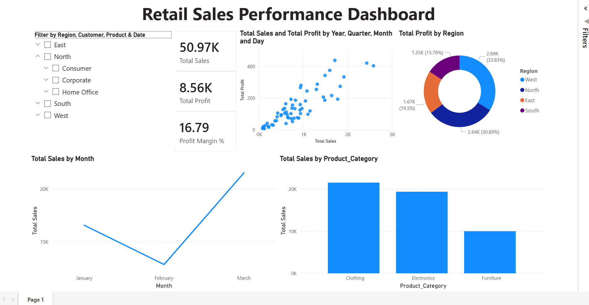

# Week 5 - Activity 2: Retail Sales Power BI Dashboard

## Overview

This activity is a Power BI dashboard created using the Retail Sales Sample Dataset.  
The purpose of this dashboard is to perform data cleaning,  data visualization, and business analysis to support decision making.

The dashboard was developed using Microsoft Power BI and focuses on sales performance, profit analysis, customer insights, and regional trends.

---

# Dataset Used

Dataset Name:

Retail_Sales_sample-Dataset.xlsx

The dataset contains retail transaction information such as:

- Order ID
- Order Date
- Product Category
- Product Name
- Region
- Sales Amount
- Quantity Sold
- Customer Segment
- Discount (%)
- Profit

---

# Data Cleaning Process

Before creating the dashboard, the dataset was cleaned properly to improve data quality and analysis accuracy.

## 1. Removed Duplicates

Duplicate records were identified and removed.

Reason:
Duplicate rows can produce incorrect totals, sales values, and misleading visualizations.


---

## 2. Handled Missing Values

Missing or blank values were checked and handled.

Techniques used:

- Numerical columns:
  Missing values replaced using median or suitable values.

- Text columns:
  Missing values replaced with "Unknown".

Reason:
Missing values may cause incorrect calculations and broken visuals.

---

## 3. Standardized Column Names

Column names were cleaned and standardized.

Example:

Before:
```text
Price per Unit
```
After:

```text
Price_per_Unit
```

Reason:  
Standardized names improve readability and reduce Power BI formula errors.

---

#  Calculated Features

Four meaningful features were created to improve business analysis.

## 1. Total_Sales

### Formula

```text
Quantity × Price per Unit
```

### Purpose
Calculates total transaction sales value.

### Business Value
Helps identify high-performing products and regions.

---

## 2. Estimated_Profit

### Formula

```text
Total_Sales × 20%
```

### Purpose
Estimates expected profit from each transaction.

### Business Value
Provides profitability insights.

---

## 3. Sales_Category

### Logic

```text
Low    = Sales < 100
Medium = Sales between 100 and 500
High   = Sales > 500
```

### Purpose
Groups transactions into sales levels.

### Business Value
Helps compare low-performing and high-performing sales groups.

---

## 4. Profit_Margin_Percent

### Formula

```text
(Estimated_Profit / Total_Sales) × 100
```

### Purpose
Measures profitability percentage.

### Business Value
Helps evaluate business efficiency and performance.

---

# DAX Measures Used

## Total Sales

```DAX
Total Sales = SUM(Cleaned_Data[Total_Sales])
```

---

## Total Profit

```DAX
Total Profit = SUM(Cleaned_Data[Estimated_Profit])
```

---

## Profit Margin %

```DAX
Profit Margin % =
DIVIDE(
    (Cleaned_Data[Total Profit]),
    (Cleaned_Data[Total Sales])
) * 100
```

---

## Total Quantity

```DAX
Total Quantity = SUM(Cleaned_Data[Quantity])
```

---

# Dashboard Visualizations

The dashboard contains several visualizations to support exploratory and descriptive analytics.


## Live Dashboard

View the interactive Power BI dashboard using the link below:

[Retail Sales Power BI Dashboard](https://app.powerbi.com/reportEmbed?reportId=05006864-868d-497a-9cb8-7fe51607a4c8)





## 1. KPI Cards

### Visual Type
Card Visuals

### KPIs displayed

- Total Sales
- Total Profit
- Profit Margin %
- Total Quantity

### Purpose
Provides quick business performance overview.

---

## 2. Sales by Product Category

### Visual Type
Bar Chart

### Purpose
Compares sales across product categories.

### Insight
Identifies best-selling product groups.

---

## 3. Sales Trend Over Time

### Visual Type
Line Chart

### Purpose
Shows sales performance trends over time.

### Insight
Helps identify seasonal patterns and sales growth.

---

## 4. Profit by Region

### Visual Type
Bar Chart / Map

### Purpose
Compares profitability by region.

### Insight
Identifies strongest and weakest regions.

---

## 5. Sales Category Distribution

### Visual Type
Donut Chart

### Purpose
Displays distribution of Low, Medium, and High sales.

### Insight
Shows sales composition and transaction behavior.

---

# Slicers / Filters Used

Interactive slicers were added to improve user exploration.

## Slicers included

- Filter by Date
- Filter by Region
- Filter by Product Category
- Filter by Customer Segment

### Purpose
Allows users to dynamically filter dashboard data.

---

# Dashboard Structure

The dashboard layout was designed to be simple and user friendly.

## Structure

1. Dashboard Title  
2. KPI Summary Cards  
3. Trend and Comparison Charts  
4. Distribution Charts  
5. Interactive Slicers  

This structure improves readability and decision-making.

---

# Business Insights Generated

The dashboard helps answer important business questions such as:

- Which product category has the highest sales?
- Which region generates the most profit?
- How do sales change over time?
- What percentage of sales belong to high-value transactions?
- Which customer segments contribute most to revenue?

---

# Conclusion

This Power BI project demonstrates the importance of:

- Data cleaning
- Feature engineering
- Descriptive analytics
- Interactive visualization
- Business intelligence reporting

The dashboard transforms raw retail data into meaningful insights that support business decision-making.

---

# Tools Used

- Microsoft Power BI
- Power Query
- DAX
- Excel Dataset

---

# Author

Benjelyn Reves Patiag

Master of Software Engineering : MSE803 Data Analytics

Yoobee Colleges
