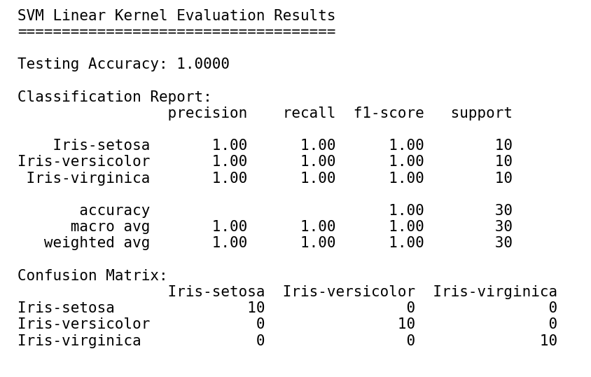
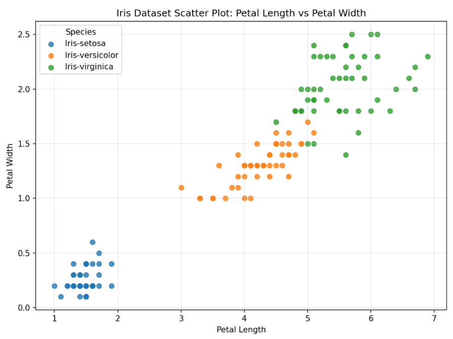

# Iris Dataset SVM Classification

## Description

This project performs **Data Analysis using Traditional Machine Learning Model: Support Vector Machine (SVM)**.

The dataset used is the **Iris dataset**. It contains flower measurements and three flower classes:

1. Iris-setosa
2. Iris-versicolor
3. Iris-virginica

The goal is to classify the flower species using these input features:

- Sepal length
- Sepal width
- Petal length
- Petal width

The model used is **Support Vector Machine (SVM)** with a **linear kernel**.

## Project Steps

1. Import sklearn dataset tools and SVM package.
2. Load the Iris dataset from `iris.zip`.
3. Clean and inspect the dataset.
4. Visualise the dataset using scatter plot.
5. Split data into training and testing dataset.
6. Train the SVM classifier using `kernel="linear"`.
7. Predict flower species using test data.
8. Evaluate the model using accuracy, precision, recall, F1-score, and confusion matrix.

## Python Package Used

```python
from sklearn import datasets
from sklearn.svm import SVC
```

Other packages:

```python
pandas
matplotlib
scikit-learn
```

## How to Run

Install required packages:

```bash
pip install pandas matplotlib scikit-learn
```

Run the Python script:

```bash
python iris_svm_linear.py
```

## Testing Dataset Evaluation Results

The dataset was split into:

- Training dataset: 80%
- Testing dataset: 20%

### Result Summary

| Metric | Result |
|---|---:|
| Testing Accuracy | 1.0000 |
| Precision | 1.00 |
| Recall | 1.00 |
| F1-score | 1.00 |

## Confusion Matrix

| Actual / Predicted | Iris-setosa | Iris-versicolor | Iris-virginica |
|---|---:|---:|---:|
| Iris-setosa | 10 | 0 | 0 |
| Iris-versicolor | 0 | 10 | 0 |
| Iris-virginica | 0 | 0 | 10 |

## Screenshot of Results


## Iris Scatter Plot



## Explanation

The scatter plot shows the relationship between **petal length** and **petal width**. These features are useful because the flower classes become easier to separate.

The SVM model uses a **linear kernel**, meaning it tries to separate the flower classes using a straight decision boundary. The result is very good because the Iris dataset is clean, small, and beginner-friendly for classification.
