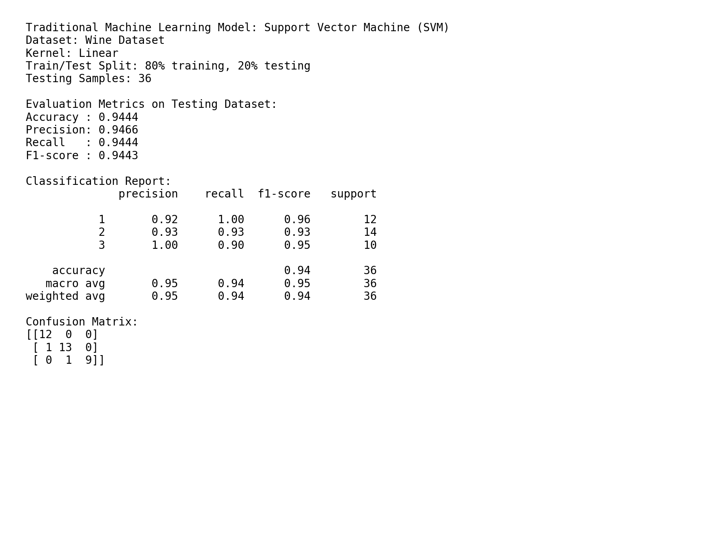
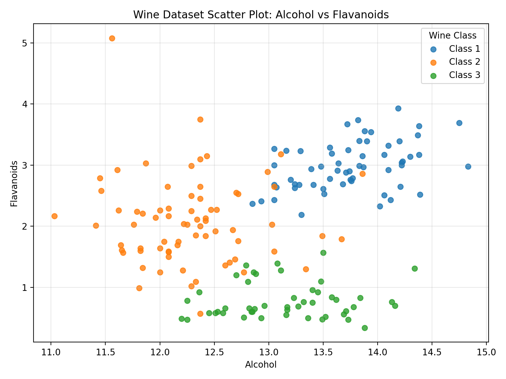

# Wine Dataset SVM Classification

##  Description
This project performs data analysis using a traditional machine learning model: **Support Vector Machine (SVM)**. The script loads the Wine dataset, checks and cleans the data, creates a scatter plot, trains a Linear SVM model, tests the model, and saves evaluation results.

## Dataset
The dataset used is the **Wine dataset** from the uploaded `wine.zip` file.

The dataset contains:
- 178 wine samples
- 13 numeric input features
- 3 wine classes

## Data Cleaning
The script performs these cleaning checks:
- Checks missing values
- Converts columns to numeric values
- Removes missing-value rows if found
- Removes duplicate rows if found

Cleaning result:
- Missing values removed: 0
- Duplicate rows removed: 0
- Rows after cleaning: 178

## Model Used
Traditional Machine Learning Model:

**Support Vector Machine (SVM)**

Kernel used:

```python
SVC(kernel="linear")
```

The model also uses `StandardScaler()` because SVM works better when numeric features are scaled.

## Workflow
1. Import required Python packages
2. Load the Wine dataset
3. Clean and validate the dataset
4. Visualise the dataset using a scatter plot
5. Split data into training and testing sets
6. Train the SVM model using a linear kernel
7. Predict the testing dataset
8. Evaluate using accuracy, precision, recall, F1-score, classification report, and confusion matrix

## Testing Dataset Evaluation Results

| Metric | Result |
|---|---:|
| Accuracy | 0.9444 |
| Precision | 0.9466 |
| Recall | 0.9444 |
| F1-score | 0.9443 |

## Output Files

The script creates these output files inside the `outputs` folder:

- `wine_scatter_plot.png` - scatter plot visualization
- `svm_results_screenshot.png` - screenshot/image of evaluation result
- `evaluation_results.txt` - full testing result text
- `cleaning_summary.txt` - dataset cleaning summary

## Screenshot of Results



## Scatter Plot



## How to Run

Install required packages:

```bash
pip install pandas matplotlib scikit-learn
```

Run the script:

```bash
python wine_svm_linear.py
```

## Main Python Example

```python
from sklearn.svm import SVC

model = SVC(kernel="linear")
model.fit(X_train, y_train)
```
