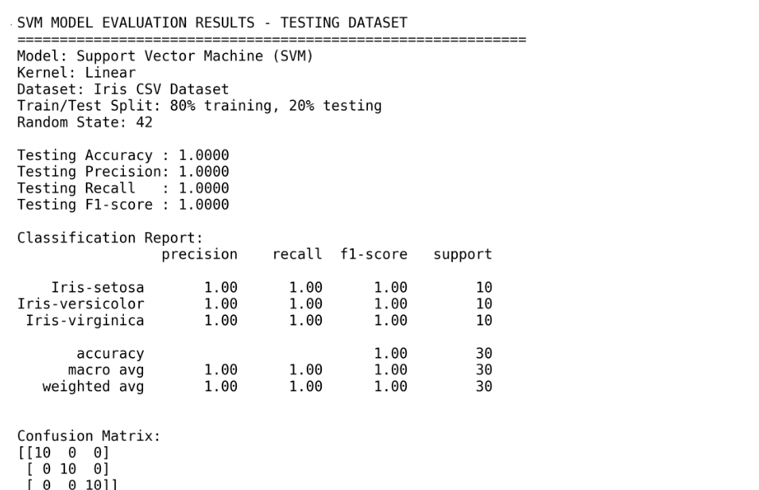
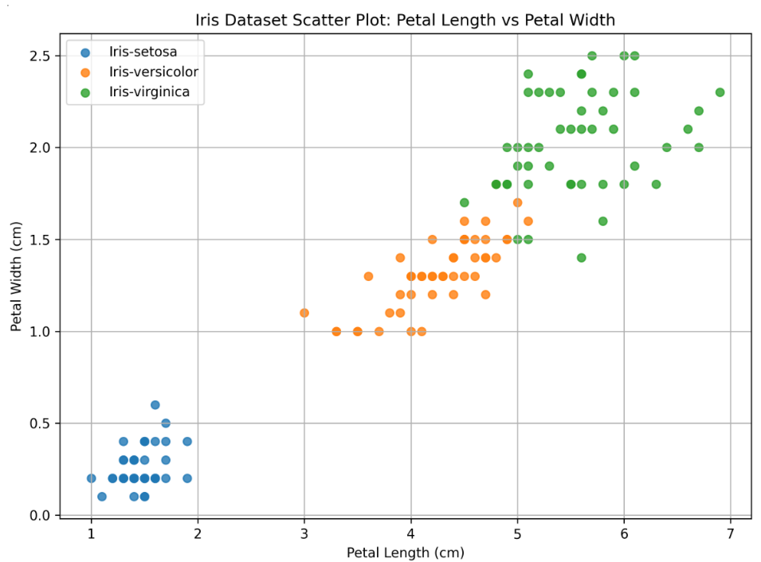
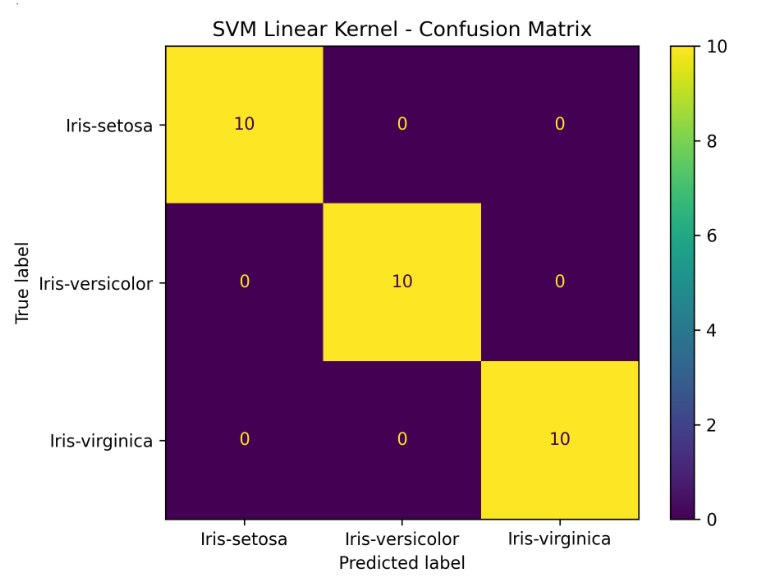

# Iris Dataset SVM Linear Kernel Project

## Description

This project performs **Data Analysis Using Traditional Machine Learning Model: Support Vector Machine (SVM)**.

The Iris dataset is loaded, cleaned, visualised using a scatter plot, then trained and tested using an **SVM model with a linear kernel**.

## Dataset

File used:

```text
data/Iris.csv
```

The dataset contains Iris flower measurements:

- Sepal Length
- Sepal Width
- Petal Length
- Petal Width
- Species

Target classes:

- Iris-setosa
- Iris-versicolor
- Iris-virginica

## Data Cleaning Summary

The dataset was checked before training.

| Check | Result |
|---|---|
| Original rows | 150 |
| Missing values | 0 |
| Duplicate rows found | 3 |
| Clean rows after duplicate removal | 147 |
| Feature data type | Numeric |
| Target data type | Category/Text |

The `Id` column was removed because it is only an identifier and not useful for model training.

## Model Used

Traditional Machine Learning Model:

```python
from sklearn.svm import SVC

model = SVC(kernel="linear")
model.fit(X_train_scaled, y_train)
```

## Evaluation Results on Testing Dataset

| Metric | Result |
|---|---:|
| Accuracy | 1.0000 |
| Precision | 1.0000 |
| Recall | 1.0000 |
| F1-score | 1.0000 |

## Confusion Matrix

```text
[[10  0  0]
 [ 0 10  0]
 [ 0  0 10]]
```

This means all 30 testing samples were predicted correctly.

## Output Screenshot



## Iris Scatter Plot



## Confusion Matrix Image



## How to Run

Install required packages:

```bash
pip install pandas matplotlib scikit-learn
```

Run the Python file:

```bash
python iris_svm_linear.py
```

## Files Included

```text
Iris_SVM_Linear_Project/
│
├── data/
│   └── Iris.csv
│
├── outputs/
│   ├── cleaning_summary.csv
│   ├── iris_scatter_plot.png
│   ├── confusion_matrix.png
│   ├── svm_results.txt
│   └── svm_results_screenshot.png
│
├── iris_svm_linear.py
└── README.md
```

## Conclusion

The Iris dataset is clean and suitable for SVM classification.  
After removing duplicate rows and scaling the features, the SVM model with a linear kernel achieved **100% testing accuracy**.
